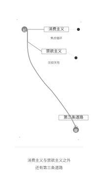
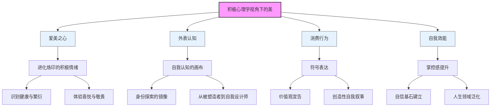
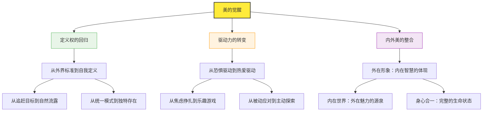
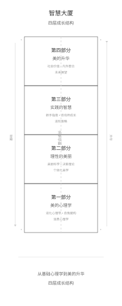
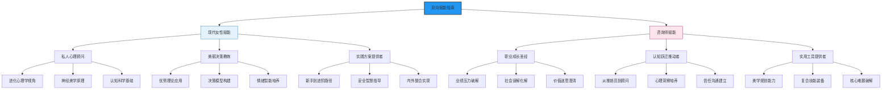

# **美的觉醒：积极心理学视角下的现代女性与专业咨询师成长指南**

## **序言：在镜中，与另一个自己相遇**

在镜中，与另一个自己相遇

亲爱的读者：

请允许我邀请您，在此刻，一同想象一个场景。

那或许是一个再寻常不过的深夜。喧嚣的世界隐退，一天的疲惫沉淀下来，你独自一人，站在浴室那面明亮而诚实的镜子前。水汽氤氲，灯光柔和，镜中的那个人，是你，又似乎不完全是你。

你端详着她。你看到了那双承载了无数工作报表与孩童睡前故事的眼睛，眼角处，几道细纹悄然记录下时光的密语，它们是你欢笑的印记，也似乎是你忧虑的注解。你看到了那片曾被青春痘肆虐过的脸颊，如今，几个若隐若现的色斑，像是岁月不经意间灑下的墨点。你看到了嘴角的弧度，它在白日里面对世界时总是习惯性地上扬，此刻，却在无人的静谧中，流露出一丝难以言说的倦意。

镜中的这个人，你与她朝夕相伴，无比熟悉，却又时常感到陌生。在这凝视的瞬间，无数个声音，可能会像潮水般，从你内心深处的四面八方涌来：

一个声音，来自你的记忆。那是少女时代，你第一次笨拙地涂上口红，镜中的自己瞬间变得明艳动人，那份纯粹的、因“变美”而生的喜悦，至今仍是心底一抹温暖的亮色。

另一个声音，来自你指尖划过的手机屏幕。那是一个由完美滤镜、精准角度和精彩生活片段拼接而成的“数字乌托邦”。屏幕里的“她们”，拥有着毫无瑕疵的皮肤、雕塑般的轮廓和永不疲惫的笑容。她们的生活，像一场永不落幕的盛宴。这个声音，像一个幽灵，在你耳边轻语：“看，那才是理想的模样。你，还差得很远。”

还有一个声音，来自这个时代无处不在的商业合唱。它们用最温柔的语调、最科学的辞藻，向你讲述着一个又一个关于“逆龄”、“新生”、“完美”的神话。它们在你每一个自疑的瞬间，精准地递上一个解决方案，并附上一句魔咒般的低语：“爱自己，就该拥有它。”

更有一个声音，可能来自你最亲近的人，甚至是你的内在批判家。它带着关切，也带着评判，告诉你：“不要太在意这些外在的东西，内在美才最重要。”“你已经很好了，不要再折腾了。”……

在这一面小小的镜子前，在这一场无人知晓的内心交战中，浓缩了当代女性在追求“美”这条道路上，所有光荣与梦想，也包含了所有挣扎与迷惘。

这，就是我们今天共同面对的处境——一个美丽的前所未有的“丰盛”与“便利”，与容貌焦虑的前所未有的“深刻”与“普遍”，同时存在的悖论时代。

我们拥有比以往任何时代都更强大的力量去塑造和管理自己的外在形象。从一管能精准修饰肤色的粉底液，到一台能穿透皮肤筋膜层的超声刀；从一篇详尽的“早C晚A”科普文，到一个能随时连接全球顶尖医生的在线问诊平台——我们手中的工具箱，从未如此琳琅满目。

然而，我们内心的平静与笃定，却似乎并未与这份“能力”成正比地增长。相反，“容貌焦虑”、“身材焦虑”、“年龄焦虑”，这些词汇像病毒一样，在我们这一代女性的集体潜意识中，悄然蔓延。追求美丽，这个本应是悦纳自我、滋养生命、充满创造乐趣的过程，在很多时候，却异化为了一场停不下来的“美丽内卷”和“自我攻击的军备竞赛”。

我们像一群被无形之手推入赛道的选手，身不由己。我们追逐着不断变化的审美标准，如同夸父追日；我们在社交媒体这个“数字楚门的世界”里，进行着一场又一场与“完美化身”的比较，耗尽了心力；我们用越来越昂贵的护肤品和越来越频繁的医美项目，来试图填补内心的不安全感，却发现那份焦虑，如同一个无底的黑洞。

于是，我们开始感到困惑，甚至疲惫。我们开始问自己：

我如此努力地追求美，究竟是为了什么？是为了成为更好的自己，还是为了成为一个更符合“标准”的他人？

我投入的这一切，究竟是在“建设”我的人生，还是在“消耗”我的生命？

那个驱动着我的，究竟是源自我内心的、对生命力的热爱，还是源自对衰老、对“被落下”、对“不够好”的深深恐惧？

通往“美”的这条路，为何越走，反而离“幸福”越远？

在这样普遍的集体困境面前，我们的社会，似乎习惯性地为我们提供了两条截然对立的、看似唯一的出路。

第一条路，是“消费主义的狂欢节”。它大声地对我们说：“你所有的焦虑，都是因为你还不够美！你所有的不快乐，都源于你对外在的投资还不够多！”于是，它将“美”彻底地商品化、指标化。它为你设定了一个又一个需要打卡的“美丽KPI”：天鹅颈、直角肩、A4腰、少女脸……然后，为你提供一整套看似精准的、明码标价的解决方案。这条路，用“爱自己”和“自我赋能”的糖衣，包裹着消费主义的内核。它鼓励我们用一种“头痛医头、脚痛医脚”的方式，去处理我们的外在。它或许能在短期内，给我们带来掌控感的幻觉和占有物的快感，但它从不真正关心，那个躲在完美妆容和紧致皮肤之下的灵魂，是否真的感到喜悦与安宁。它最终引向的，往往是一个更深的循环：短暂的满足，继而是对新“不完美”的发现，和新一轮更焦虑的追逐。

第二条路，则是“禁欲主义的道德审判”。它站在消费主义的对立面，用一种居高临下的姿态，对我们说：“看重外表，就是肤浅！追求美丽，就是虚荣！你们这些女人，为什么不能只关注自己的内在？”这条路，试图通过将外在美与内在美进行粗暴的、非黑即白的对立，来解决问题。它将一个复杂的、关乎人性的深刻议题，简单地归结为一个“道德”问题。它否定我们天性中对和谐、秩序与生命活力的本能向往，也无视在一个高度视觉化的现代社会中，良好的外在形象所具备的实际功能与价值。它给我们带来的，除了站在道德高地上的自我感动，便是对自身天性的压抑和深刻的负罪感。它让我们在每一次对镜梳妆时，都感觉自己仿佛犯了某种“思想原罪”。

我们中的许多人，就在这两条看似背道而驰的死胡同之间，来回摇摆，无所适从。要么，在消费的洪流中，身心俱疲，渐渐迷失了自我；要么，在道德的紧箍咒下，压抑天性，活得拧巴而干涸。

难道，就没有第三条路可走了吗？

难道，我们就注定要在"成为一件被精心打造的商品"和"成为一个粗糙但所谓'有思想'的苦行僧"之间，做出非此即彼的选择吗？

消费主义与禁欲主义之外，还有第三条道路

**本书的诞生，正是为了旗帜鲜明地、用尽全部的诚意与智慧，为您指出并照亮这至关重要的"第三条道路"。**

我们坚信，这条路是存在的。它不通向左，也不通向右，而是通向上——通向一个更整合、更深刻、也更自由的生命维度。这条路的起点，既不在美容院的仪器上，也不在商场的货架上，更不在他人的评判中。它的起点，在我们的内心，在我们看待自己、看待美、看待这个世界的认知框架之中。

而为我们照亮这条路的灯塔，是一门在过去二十年里蓬勃发展、致力于研究人类最佳体验的、充满温暖与希望的科学——**积极心理学（Positive Psychology）**。

与专注于治疗"疾病"与"障碍"的传统心理学不同，积极心理学将它的目光，聚焦于人类的"优势"、"美德"与"幸福"。它不问"你的人生有什么问题？"，而是问"你的人生，在何种条件下，才能达到繁盛与绽放？"。它不满足于将一个人的状态从-8修复到0，它更关心如何帮助每一个人，从0走向+8，甚至达到+10的巅峰体验。

当我们用积极心理学的这束光，来重新审视"追求美"这件事时，一幅全新的、令人豁然开朗的图景，便呈现在了我们眼前：

**原来，"爱美"之心，并非肤浅的欲望，而是进化烙印在我们基因深处的、最古老的"积极情绪"来源之一。** 它在远古时代，帮助我们的祖先识别健康的配偶与丰饶的环境，是一种宝贵的生存智慧。在今天，它依然是我们体验喜悦、敬畏、希望等一系列积极情绪的重要通路。

**原来，"外表"，是我们建构自我认知、进行身份探索的最直观的"画布"。** 我们与"镜像"的每一次互动，我们进行的每一次"社会比较"，都是在回答"我是谁"这个终极问题。理解了这背后的心理机制，我们就能从被动的"被塑造者"，转变为主动的"自我设计师"。

**原来，"消费"，不仅仅是购买，更是一种深刻的"符号表达"。** 我们选择的每一件物品，都在向世界宣告我们的品味、我们的价值观、我们的身份认同。它是一场无声的、充满创造性的"自我叙事"。

**原来，一次成功的外表改善，其核心价值，并非换取他人的艳羡，而在于它能极大地提升我们内在的"自我效能感"与"掌控感"。** 这种"我能行"的信念，会从美丽这件事，泛化到我们人生的各个领域，成为我们自信的基石。

当这些全新的认知被建立起来时，一场深刻的美学觉醒，便在我们的内心悄然发生了。

**美的觉醒，不是指你突然明白了什么妆容最流行，什么项目最有效。它是一场认知与情感的革命。**

**它意味着，你终于将"美"的定义权，从外界收回到了自己手中。** 美，不再是一个需要你费力追赶的、遥远而苛刻的"标准"；它变成了你自身生命力的自然流露，一种你选择向世界呈现自己独特存在的方式。

**它意味着，你终于将"追求美"的驱动力，从"对负面事物的恐惧"，转换为了"对积极事物的热爱"。** 你不再是因为"害怕丑、害怕老、害怕被淘汰"而去行动；你是因为"热爱生活、享受创造、渴望探索自己更多的可能性"而欣然前往。这份驱动力的转变，将使你的整个求美过程，从一场焦虑的挣扎，变成一场充满乐趣的、滋养心灵的游戏。

**它意味着，你终于学会了将"外在美"与"内在美"进行完美的整合。** 你明白，一副精心管理、传递着健康与活力的外在形象，是你内在智慧、善良与力量的最佳"名片"；而一个丰盈、笃定、不断成长的内在世界，则是你外在皮囊最动人、也最持久的"灵魂高光"。

**这，就是本书的核心使命：引领并陪伴您，完成这场"美的觉醒"。**

为了达成这个使命，我们为你构建了一座四层楼的"智慧大厦"：

从基础心理学到美的升华，四层成长结构

**在第一部分"美的心理学"**，我们将扮演"思想的考古学家"，与您一同深潜入人类心灵的源头，去理解"爱美"这份古老天性背后的深层智慧，以及"自我"与"消费"的真正意义。这，是为我们整趟旅程，奠定最坚实、最深刻的认知基石。

**在第二部分"理性的美丽"**，我们将化身"科学的解码者"与"决策的建筑师"，为您全景式地呈现"美丽"背后的生物学与神经美学原理，并为您装备上一整套融合了积极心理学、风险管理和批判性思维的、理性而温暖的决策框架。拥有了它，您将能像一位最顶级的投资人一样，为自己的美丽事业，做出最明智的选择。

**在第三部分"实践的智慧"**，我们将成为您"随行的实战教练"，手把手地带您走过从"新手上路"到"进阶玩家"的全过程，并为您准备好应对各种现实挑战的"心理急救包"。特别地，我们还将用一个独立的、充满敬意的章节，为身处一线的"医美咨询师"们，提供一条从"销售困境"到"职业觉醒"的专业成长之路。因为我们坚信，一个更健康的行业，需要从业者与消费者的共同觉醒与双向奔赴。

**在第四部分"美的升华"**，我们将作为您"攀登山峰的伙伴"，与您一同将视野从"个人成长"拓宽到"社会价值"，探讨如何整合内在的人格魅力，并运用自己的影响力，去推动一个更多元、更包容的审美文化的形成。同时，我们还将一同展望未来，思考在一个科技日新月异的时代，我们该如何坚守人文的温度，实现"终身的美丽成长"。

这不仅是一本书，它更应被看作一个工作坊、一本个人成长的实践手册。因此，书中包含了大量的"实用工具"、"思考练习"和"行动指南"，我们真诚地邀请您，在阅读时，拿起笔，或打开您的电子笔记，跟着我们的引导，一步步地去完成它们。因为真正的"觉醒"，从来不发生在"知道"的瞬间，而发生在"做到"的每一个具体的行动里。

**亲爱的读者，我知道，您可能正带着一丝疲惫、一缕困惑、一份期待，翻开了这本书。**

或许，您是那个在“变美”的道路上，投入了大量金钱与精力，却依然感觉不到快乐的“资深玩家”，您渴望找到那份遗失已久的、对美的初心与喜悦。

或许，您是那个站在美丽世界门口，充满好奇又心怀忐忑的“新手”，您渴望有一份权威、可靠、充满善意的指南，能牵着您的手，安全地走好这第一步。

又或许，您是那个身处行业之中，被业绩与初心反复撕扯的“专业人士”，您渴望为自己的工作，找到一份更高的意义和更受尊敬的未来。

无论您是谁，无论您身处何方，我都想对您说：**欢迎您。您来对了地方。**

这本书，就是为您而写。

它无法承诺您一张完美无瑕的面孔，也无法给您一个一劳永逸的答案。但它郑重地向您承诺：

当您合上这本书时，您将拥有一种全新的、更强大、也更慈悲的"心智模式"，去面对关于美、关于自我、关于人生的种种议题。

您将拥有一套清晰的、行之有效的"决策系统"，让您在未来，能为自己做出一次又一次无悔的选择。

您将获得一份由内而外的、不依赖于他人评价的"笃定与自信"，这份自信，源于您对科学的深刻理解，更源于您对自我价值的全然接纳。

最重要的是，您将开启一场真正意义上的、属于您自己的"美丽人生"。在这场人生里，"美"，不再是您焦虑的源头，而是您幸福的活水；不再是您背负的枷锁，而是您翱翔的翅膀。

现在，就请您，深吸一口气，暂时放下外界所有的喧嚣与评判，也放下您对自己所有的苛责与怀疑。让我们一同，开启这场注定不凡的、探索与绽放的旅程。

让我们在镜中，与那个更真实、更完整、也更光芒万丈的自己，温暖相遇。

## 美，作为人类永恒的追求（代序）

美，是铭刻在人类基因里的古老密码，是贯穿文明历史的永恒追求。从旧石器时代洞穴岩壁上灵动奔放的野牛，到古埃及法老黄金面具的威严对称；从古希腊哲人对“和谐便是美”的深邃思辨，到文艺复兴巨匠们用画笔与刻刀赞颂人体的荣光；从东方园林里的一步一景、曲径通幽，到现代T台上颠覆传统、石破天惊的时尚宣言——千百年来，无论种族、文化、地域如何变迁，人类对美的探寻与创造，从未停歇。

这份追求，如此本能，如此深刻。它潜藏在我们每一次被落日熔金的壮丽所震撼的时刻，每一次为一首动人旋律而潸然泪下的瞬间，每一次凝视新生儿完美无瑕的脸庞时心中涌起的无限柔情。美，是我们感知世界、表达自我、链接彼此的通用语言。它像一道光，能穿透日常的琐碎与平庸，照亮我们内心最深处对秩序、和谐、生命力与超越性的渴望。

然而，在物质极大丰富、信息爆炸式增长的今天，这条通往美的道路，似乎变得前所未有的喧嚣、复杂，甚至充满荆棘。现代女性，作为这场美丽浪潮的核心参与者，正面临着一个充满悖论的处境：

一方面，我们拥有了空前广阔的选择权。护肤科技日新月异，医学美容的边界不断拓宽，时尚潮流的更迭目不暇接，社交媒体为我们打开了通往全球美学灵感的万千窗口。理论上，我们可以前所未有地掌控、塑造并展现自己的美。

但另一方面，我们也被前所未有的焦虑与困惑所裹挟。“A4腰”、“筷子腿”、“精灵耳”……层出不穷的审美标准像一张无形的网，将我们紧紧束缚；社交媒体上被精心滤镜、完美构图的生活，构建了一个看似触手可及却又遥不可及的“数字镜像”，引发着永无止境的社会比较；消费主义的话术，将“爱自己”简单粗暴地等同于“买买买”，用“你值得拥有”的口号，巧妙地挑逗着我们的欲望，也悄然掏空我们的钱包。

在“容貌焦虑”、“身材焦虑”、“年龄焦虑”的集体迷雾中，我们对美的追求，时常偏离了其滋养生命、带来幸福的初衷。它不再是一场愉悦的自我探索，而更像一场停不下来的军备竞赛。我们投入了大量的时间、金钱与精力，却未必收获了与之匹配的内心丰盈与笃定。当每一次“求美”行为的背后，都伴随着“我够不够好”的自我怀疑时，我们获得的究竟是解放，还是更深的枷锁？

面对这一困境，市面上似乎只存在两种截然对立的声音：一种是消费主义的极致狂欢，它不断制造新的需求，告诉你“只有更美，才能更幸福”；另一种则是禁欲主义式的批判，它将一切对外表的关注都视为肤浅和虚荣，呼吁我们彻底摒弃外在，只关注“内在美”。

但这两种声音，都忽略了问题的核心：美，本应是内外和谐的统一体；追求美的过程，本应是一场关乎自我意识觉醒、潜能探索与生命绽放的完整旅途。

**本书的诞生，正是为了提供这"第三条道路"。**

我们拒绝将外在美与内在美粗暴地对立起来，也拒绝将个人选择简单地归罪于消费主义的陷阱。我们相信，答案蕴藏在一门更深邃、更温暖的科学之中——**积极心理学（Positive Psychology）**。

作为专注于研究人类优势、美德与幸福的科学，积极心理学为我们提供了一个全新的、充满建设性的视角。它不问“你有什么问题？”，而是问“你的优势是什么？”；它不只关心如何修复创伤，更关心如何构建幸福。它将带领我们跳出“焦虑-解决”的被动循环，进入“探索-成长”的主动模式。

**本书的使命，是成为一本双向赋能的指南。**

对于每一位走在美丽成长路上的现代女性，本书将是你的"私人心理顾问"与"美丽决策教练"。我们将从进化心理学、神经美学、认知科学的源头出发，带你重新理解"爱美"这一天性的深层智慧；我们将运用优势理论、决策模型、情绪智能，帮助你构建一套理性而温暖的选择框架，让你在纷繁的信息中保持清醒，做出真正忠于自己内心、服务于长期幸福的决定；我们还将提供一套从新手到进阶的完整实践方案，让你在追求美的道路上，走得更安全、更智慧、也更快乐。最终，这本书希望引导你完成一场从外在美到内在魅力的整合，实现一场"美的觉醒"，收获整个人生的"丰盛绽放"。

对于身处行业一线、渴望实现职业跃迁的医美咨询师们，本书将是你的"职业成长圣经"。我们深知你们所面临的业绩压力、社会误解与价值迷思。本书将首次系统性地直面这些困境，并提供一套切实可行的解决方案。我们将帮助你完成从"推销员思维"到"顾问思维"的认知跃迁，为你装备上心理洞察、美学规划、信任沟通的复合能力，并提供一系列可以立刻上手的实用工具，助你破解执业中的核心难题。我们的目标，是帮助你摆脱"销售"的身份枷锁，重塑自我价值，成为一名真正值得客户信赖、陪伴其共同成长的"美丽成长伙伴"，在成就客户的同时，也成就一个更受尊敬、更有价值的职业生涯。

**本书的价值观立场是中性、客观、积极且充满人文关怀的。** 我们不鼓吹任何一种特定的审美标准，也不盲从任何一种医美技术。我们坚信，美的最终定义权，在你，且只在你自己的手中。我们尊重每一个独立个体基于充分知情、理性决策后做出的选择。我们所做的，是为你点亮一盏名为“科学”与“智慧”的灯，驱散迷雾，让你清晰地看到脚下的路，以及远方的风景。

美，不应是焦虑的源头，而应是幸福的活水。

现在，就让我们一同开启这场美的觉醒之旅。这不仅关乎外表的改善，更关乎心智的成熟、人格的完善，以及生命可能性的全然绽放。

欢迎你，与我们同行。

